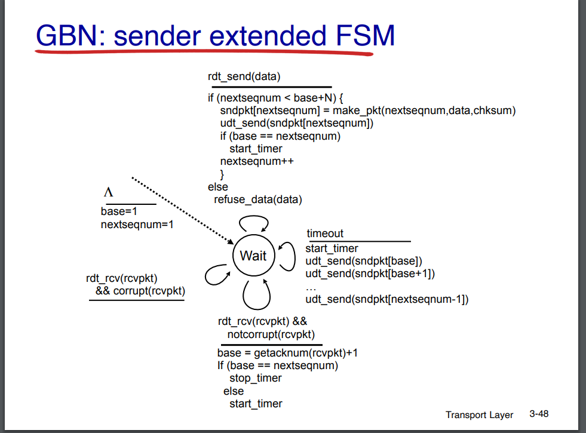
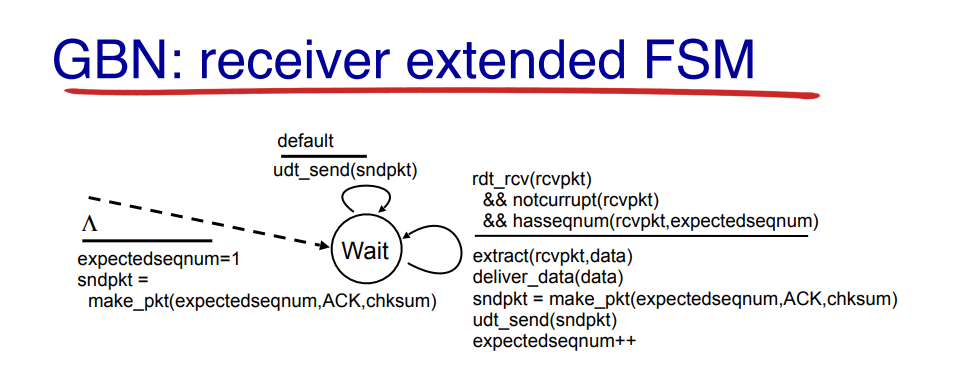

# Information
Full Name: Mohammad Amin Karami

Student ID: 98105998

# How to Run the Code
The project is written in Python. To execute the code, follow these steps:

1. Open your terminal/console.
2. Navigate to the project directory.
3. Run the following command to start the code:

```bash
make run
```

4. Additionally, you need to run the `lossy-link` for reliable UDP communication. To do this, open another console and run the following command:

```bash
make run-lossy-link
```

With the above commands, you can start an ncat client on port 12345 and an ncat server on port 54321.

# Code Description
The implementation is located in the `src` directory.

The implemented algorithm is the GBN (Go-Back-N) algorithm, which is implemented on both the sender and receiver sides.

### client_wrapper:
This module sits between the lossy-link and the ncat client and is responsible for ensuring UDP reliability.



The FSM (Finite State Machine) chart of the implemented algorithm is shown above. This module receives packets from the client, adds a sequence number to the beginning of the packet, and sends it to the lossy-link.

Additionally, if an acknowledgment (ack) is received from the `server_wrapper`, it handles timeouts and runs the GBN algorithm accordingly.

To handle timeouts, a thread is opened to periodically check for timeouts and retransmit missing packets based on the timeout.

### server_wrapper:
This module sits between the lossy-link and the server and is responsible for sending packets correctly and in order to the server.



The algorithm is implemented according to the chart shown above. This module receives packets from the lossy-link, checks their order, and if a correct packet is received, it extracts the original packet from the sent packet and forwards it to the server. It also sends an acknowledgment (ack) for the sequence number of the next expected packet to the client.

If an incorrect packet is received, it simply sends an acknowledgment for the expected packet to the client.

The `configs` and `utils` files are also used in the code.